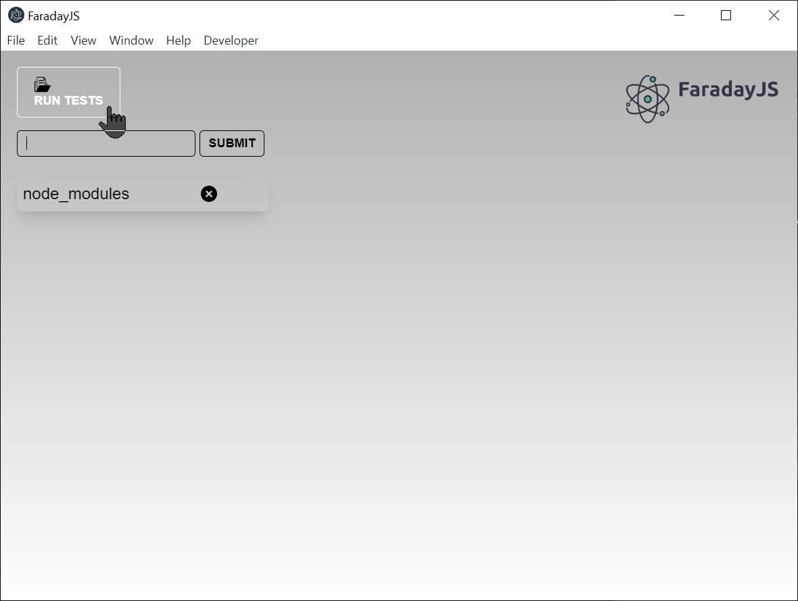
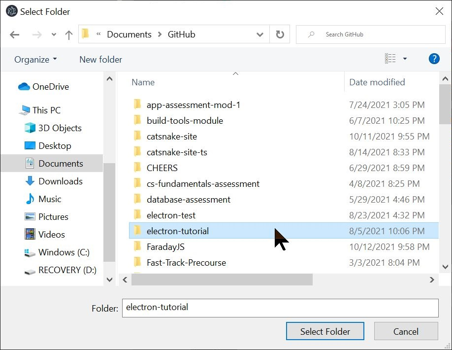
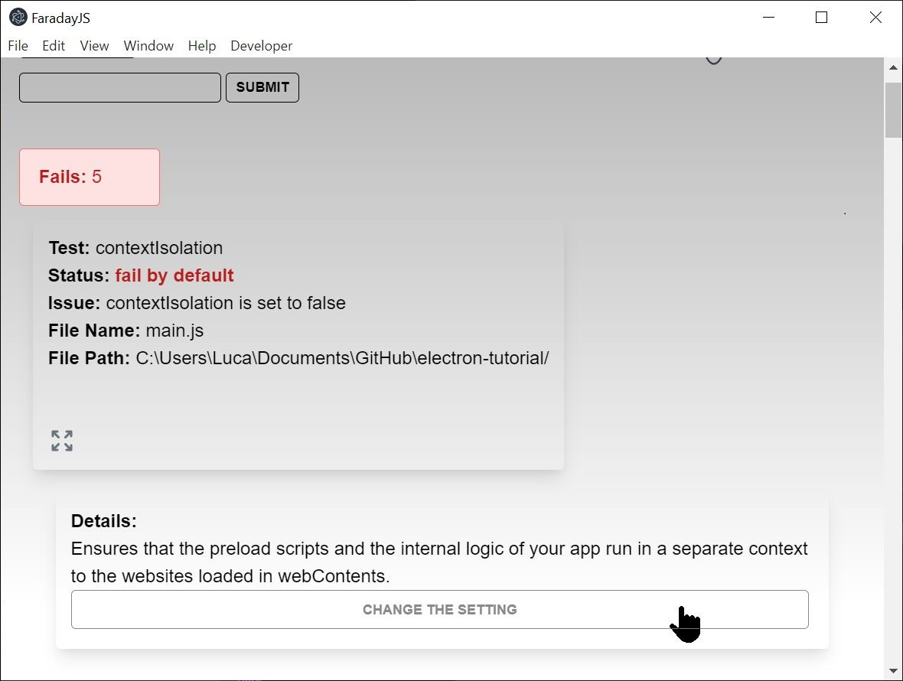
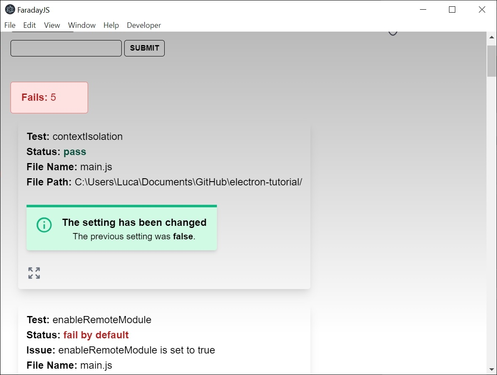

FaradayJS- electron security.

<h2>Table of Contents</h2>

- [About](https://github.com/oslabs-beta/FaradayJS/#About)
- [Features](https://github.com/oslabs-beta/FaradayJS/#Features) 
- [Download FaradayJS](https://github.com/oslabs-beta/FaradayJS/#get)
- [How to Use](https://github.com/oslabs-beta/FaradayJS/#Example)
- [Team](https://github.com/oslabs-beta/FaradayJS/#Team) 
- [License](https://github.com/oslabs-beta/FaradayJS/#License) 
- [Languages & Tools](https://github.com/oslabs-beta/FaradayJS/#Languages)

<h2 href="#About">About FaradayJS</h2>

Similar to how the Faraday cage blocks electromagnetic fileds, FaradayJS protects electron developers from settings which would make their applications vulnerable.

<h2 href="#Features">Features</h2>

<h2 href="#get">Download FaradayJS</h2>

FaradayJS can be downloaded for Windows, Mac and Linux systems at our website: <a href='http://www.faraday.js.com'>faradayjs.com</a>

<h2 href="#Example">How to Use</h2>

  
  
  
  

<h2 href="#Team">Our Team</h2>

The team at FaradayJS 

<table align="center">
  <tr>
    <td valign="top"> </td>
    <td valign="top"> </td>
    <td valign="top"> </td>
    <td valign="top"> </td>
  </tr>
  <tr>
      <td valign="top"><h2 align="center">Kelsey Flynn</h2></td>
      <td valign="top"><h2 align="center">Rosio Reyes</h2></td>
      <td valign="top"><h2 align="center">Heeho Kang</h2></td>
      <td valign="top"><h2 align="center">Miklós Kertész</h2></td>
  </tr>
   <tr>
      <td align="center"></td>
      <td align="center"></td>
      <td align="center"></td>
      <td align="center"></td>
  </tr>
</table>

<h2 href="#License">License</h2>

This product is licensed under the MIT License.

This open source product is accelerated by [OS Labs](https://opensourcelabs.io/).

<h2 align="left" href="#Languages">Languages and Tools:</h2>

 
 
 
  
 
 
    

